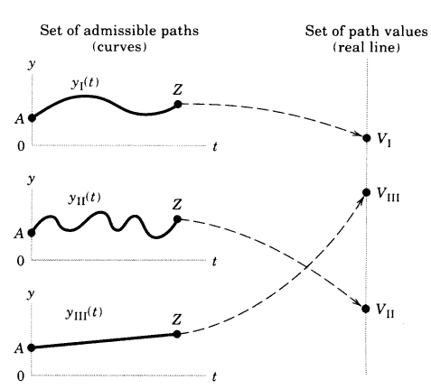

# 0. Intro  

Consider at the initial time(=0) sth is at the initial state(=A), and at terminal time(=T) sth is at the terminal state(=Z).  
The inital point stands for (0, A), and the terminal point does for (T, Z)  

In dynamic optimization,  
**1.** initial point and terminal point are given  
**2.** there are some paths(admissible paths) from the given initial to the terminal point  
**3.** there are the path value for each path  
**4.** the optimal path maximizes or minimizes the path value amoung the set of paths  

So, even the combination of the initial point(=(0,A)) and the terminal point(=(T,Z)) are same, if two paths from A to Z are different, the path values are different, and both cannot be optimal.  

But how the path value is determined ?  
  
&ensp; *ref.* Chiang(1999), "*Elements of Dynamic Optimization*", p.7, Fig1.3.  

***Def***. **Functional** returns some value when it takes some function.  
$$V[y]$$ where y is some function like y(t) and V[y] gives some value.  

### Transversality Condition  

We assumed the initial and terminal point are given. However, the terminal point, the terminal state or terminal time could be flex.  
And this statement could be considered for initial point.  

Here, the initial point is fixed is assumed, so just consider the case terminal point is flex.  

#### 1. Variable terminal point problems

Here, T is a finite.  

1. **fixed-time-horizon problem**:  
   terminal time T is fixed but terminal point is flexible.  

2. **fixed-endpoint problem**:  
   terminal point Z is fixed but terminal time is free.  

3. **terminal-curve problem**:  
   neither T nor Z are preset, but tied together; Z = &phi;(T). Therefore, even though T and Z are flexible, there's only one degree of freedom in the choice of the terminal point.  

#### 2. Transversality condition  

To achieve the optimal solution, an additional condition is needed under variable terminal point problems.  

*ex*:  
**fixed case**  
the optimal path must satisfy the boundary (initial and terminal) conditions  
$$y(0) = A \quad \text{and} \quad y(T) = Z \qquad \text{(T, A, and Z are given)}$$  

**variable case**  
the initial conditon y(0) = A still applies by assumption. But y(T) = Z is no longer capable of determining the optimal path since there are other paths which satisfy it.  

Therefore, additional condition is needed.  
**transversality condition**: terminal condition which distinguish the optimal path from the other admissible paths.  

#### 3. The objective functional  

An optimal path is one that maximizes or minimizes the path value V[y]. But how does V[y] output the value ?  
The answer is integral(sum when discrete), and for integral, we need (1) the starting time **t**, (2) the starting state **y(t)** and (3) the direction in each time **$d y/d t$** for all $t$.  
So, $V[y] = \int^T_0F[t,y(t),y'(t)]dt$ is the value of the path.  

# 1. Calculus of variation  

Calculus of variation can only find relative(local) extremum.  

Think about the simple problem.  
$$\begin{gather}
max \space \text{or} \space min \qquad V[y] = \int^T_0F[t,y(t),y'(t)]dt \notag \\
\text{subject to} \qquad y(0) = A \qquad \notag \\
\text{and} \qquad y(T) = Z \notag \\ 
\end{gather}
$$  
where A and T and Z are given. And *F* is twice differentiable.  

***Def***. **extremal** is a y path which yields an maximum or minimum of V[y]  

### 1-1. The Euler Equation  

Let y*(t) be a extremal and we know it. Let's find some unique property of the extremal. Around stationary point, the change of functional is quite small by changing its function. Therefore, we can generate the perturbing curve,  
$$y(t) = y^*(t) + \epsilon p(t) \qquad \text{implying}\space y'(t) = y^{*}{'}(t) + \epsilon p'(t)$$ where $p(t)$ is arbitrary(p(0)=0=p(T)=0).  
As $ \epsilon \to 0 $, $ y(t) \to y^*(t) $. Because y(t) and y*(t) are given, each value of $\epsilon$ determines one particular neighboring $y$ path, which is one particular value of $V[y]$.  
Therefore, we can think $V(\epsilon ) $. When $\epsilon = 0$, V[y] = V[y*(t)] has extremum.  
$$ \left. \frac{dV}{d\epsilon } \right |_{\epsilon = 0} = 0 $$
This is the necessary condition for extremal.  

#### Differentiating a Definite Integral  

Consider the definite integral;  
$$ I(x) \equiv \int_a^b F(t,x) dt $$  
F($\cdot$) changes w/ x, so this integral also changes w/ x. And the derivation is:  
$$ \begin{align}\frac{dI}{dx} = \int_a^bF_x(t,x)dt \qquad [Libeniz\space rule]\end{align}$$  
where $F_x$ is $dF/dx$.  
Let $J(b,a) \equiv \int_a^bF(t,x)dt $. From this, we can get:  
$$\begin{align}
\frac{\partial J}{\partial b} &= \left. F(t,x) \right |_{t=b} = F(b,x)\\
\frac{\partial J}{\partial a} &= \left. -F(t,x) \right |_{t=a} = -F(a,x)
\end{align}$$  
These formulas can be combined. For example, let $K(x) \equiv \int_a^{b(x)} F(t,x) dt $. It's derivation by x is:  
$$\frac{dK}{dx} = \int_a^{b(x)} F_x(t,x) dt + F[b(x),x]b'(x) $$  

#### Devlopment of the Euler Equation  

1. Represent V by $\epsilon$, and find FOC;,  
   $$V(\epsilon) = \int_0^TF[t, y^{*}(t)+\epsilon p(t), y^{*'}(t)+\epsilon p'(t)]dt$$  
   FOC:  
   $$
      \begin{align}
         \frac{dV}{d\epsilon} 
         = \int_0^T\frac{\partial F}{\partial \epsilon}dt 
         &= \int_0^T(\frac{\partial F}{\partial y}\frac{d y}{d \epsilon}\frac{\partial F'}{\partial y'}\frac{d y'}{d \epsilon})dt \notag \\
         &= \int_0^T[F_yp(t) + F_{y'}p'(t)]dt = 0
      \end{align}
   $$

2. To calculate the second integration, we use the formula of integration by parts  
$$\int f(x)g(x)dx = f(x)G(x) - \int f'(x)G(x)dx$$
Then,  
$$
   \begin{align}
      \int_0^TF_{y'}p'(t)dt
      &= [F_{y'}p(t)]^T_0 - \int_0^T\frac{dF_{y'}}{dt}p(t)dt \notag \\
      &= -\int_0^T\frac{dF_{y'}}{dt}p(t)dt
   \end{align}
$$
$[F_{y'}p(t)]^T_0 = 0$ cuz $p(T)=p(0)=0$
We can rewrite (4) and compute,
$$\begin{equation}\int_0^T p(t) [F_y - \frac{dF_{y'}}{dt}] dt=0 \tag{4'}\end{equation}$$  

3. Since p(t) is arbitrary, (4') holds only when [ $\cdot$ ] = 0 for any t.  
This is the Euler equation:  
$$
   \begin{align}
      &F_y - \frac{dF_{y'}}{dt} = 0 \qquad \text{for all t} \in[0,T] \\
      &\iff \int F_ydt = F_{y'} \notag
   \end{align}
$$
# 2. Optimal Control: The Maximum Principle  

The calculus of variations can be applied under some restrictions (function is differentiable and its solution must be internal)  

### 2-1. The Maximum Principle  

#### Costate Variable and Hamiltonian  
